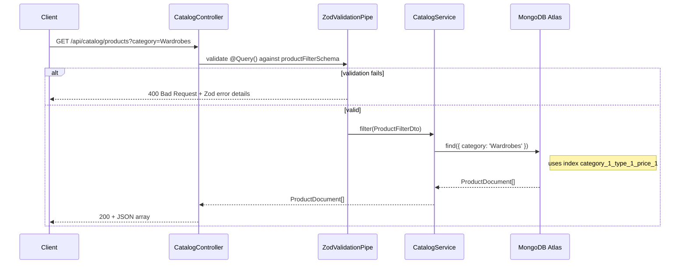
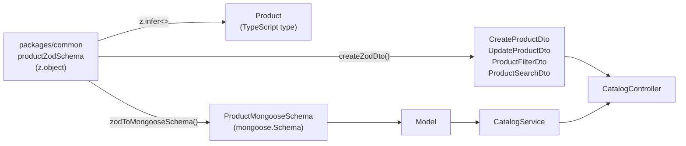
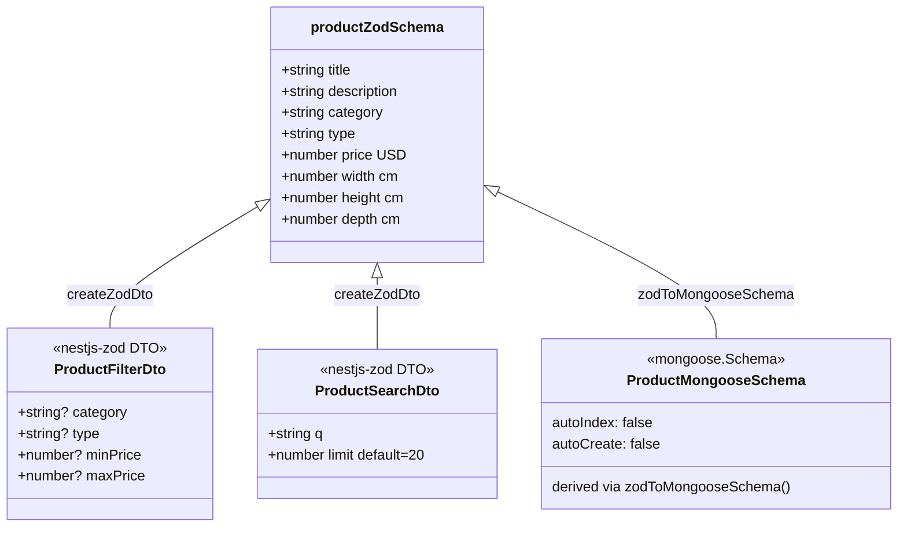

# Catalog Module Architecture

## Request Flow

## Zod → DTO → Mongoose Pipeline

## Data Model

## Atlas Index Usage

| Endpoint | Index | Query |
|---|---|---|
| `GET /catalog/products` | `category_1_type_1_price_1` | `find({ category?, type?, price? })` |
| `GET /catalog/products/search` | `title_text_description_text` | `find({ $text: { $search: q } })` |
| `GET /catalog/products/:id` | `_id_` | `findById(id)` |
