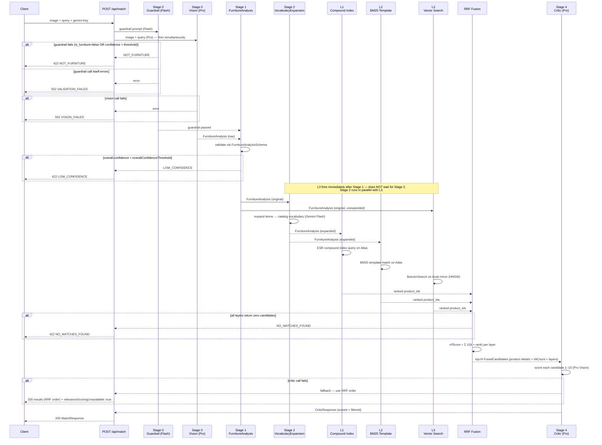
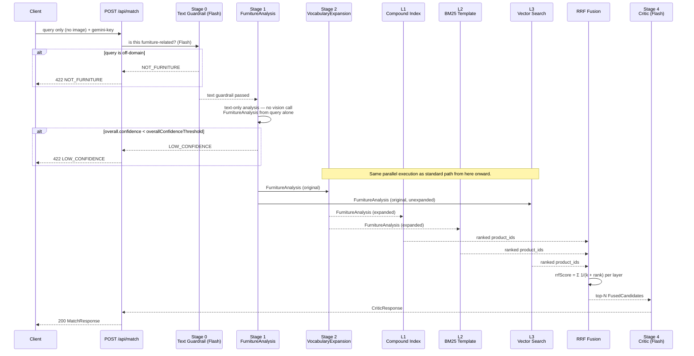
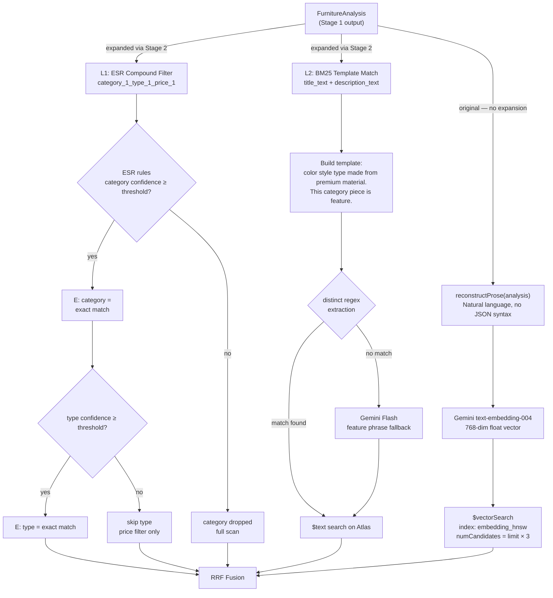
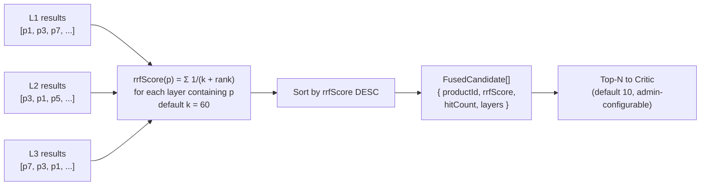

# F4 — Matching Pipeline Architecture

## Table of Contents

- [Standard Path (Image + Query)](#standard-path-image--query)
- [Text-Only Path (Query Only)](#text-only-path-query-only)
- [Stage 3 Retrieval Layers](#stage-3-retrieval-layers)
- [RRF Fusion](#rrf-fusion)

---

## Standard Path (Image + Query)

---

## Text-Only Path (Query Only)

---

## Stage 3 Retrieval Layers

---

## RRF Fusion

