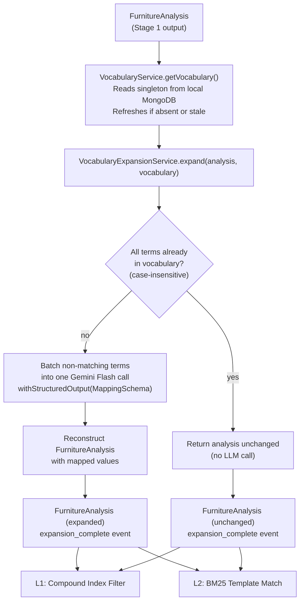
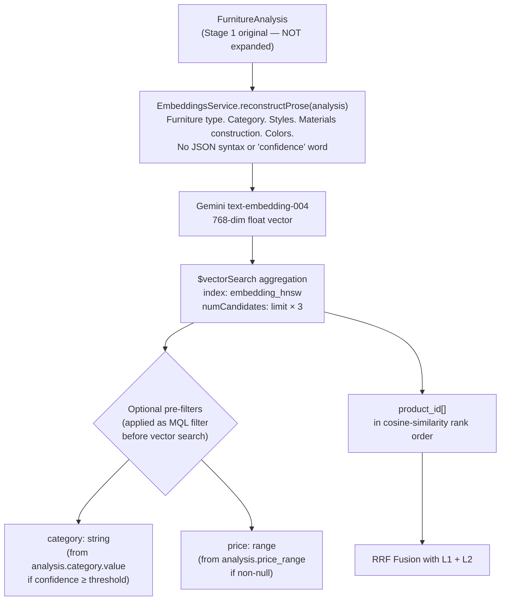
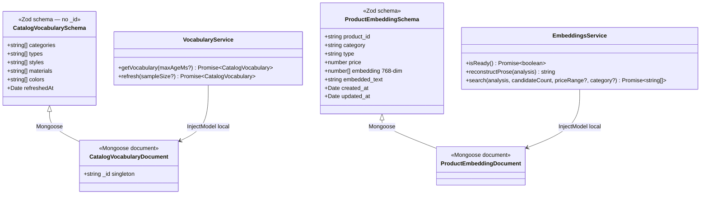
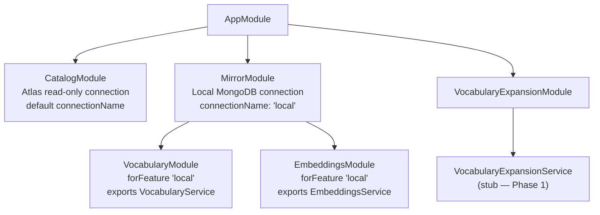

# Stage 2 (Vocabulary Expansion) + Stage 3 L3 (Vector Search) Architecture

## Table of Contents

- [Stage 2 — Vocabulary Expansion Flow](#stage-2--vocabulary-expansion-flow)
- [Stage 3 L3 — Vector Search Flow](#stage-3-l3--vector-search-flow)
- [Local Mirror Data Models](#local-mirror-data-models)
- [NestJS Module Dependency Graph](#nestjs-module-dependency-graph)

---

## Stage 2 — Vocabulary Expansion Flow

---

## Stage 3 L3 — Vector Search Flow

---

## Local Mirror Data Models

---

## NestJS Module Dependency Graph

